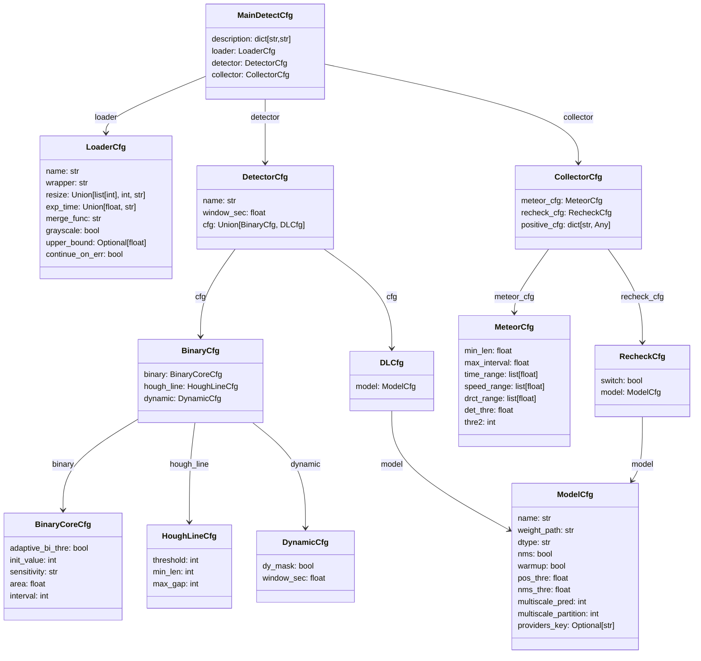
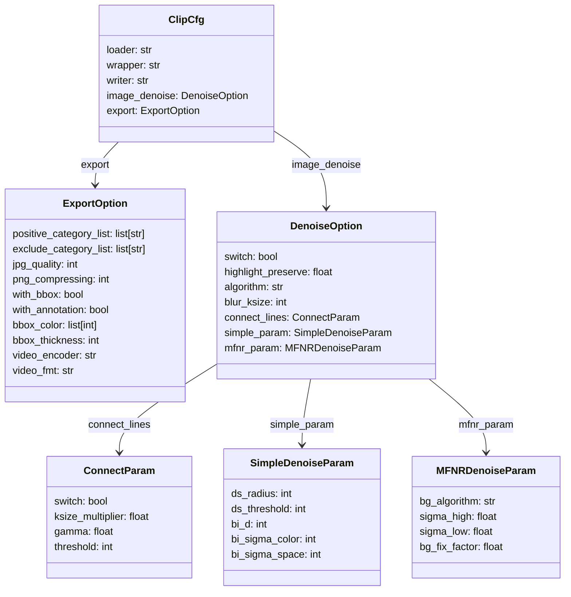

# 参数设置文档

<center>语言: <a href="./config-doc.md">English</a> | <b>简体中文</b> </center>

`MetDetPy` 及 `ClipToolkit` 从配置文件中加载运行参数。大多数情况下，预设的配置文件能够较好的工作，但有时也可以调整参数可以取得更好的效果。该文档解释了上述两个工具使用的各项参数的含义，用户可以根据需要修改自己的视频读取配置，流星检测的参数，过滤流星的边界条件，图像降噪等能力的参数。

⚠️ 当修改配置文件时，需要确保格式符合规范，否则会在参数加载阶段提示错误。

## Menu

[MetDetpy - 检测参数设置](#检测参数设置)
[ClipToolkit - 剪切参数设置](#剪切参数设置)

## 检测参数设置

### 简介

检测配置文件是`JSON`格式的文本，主要包含4个部分：[描述文本(description)](#描述文本description)， [视频加载器(loader)](#视频加载器loader)， [检测器(detector)](#检测器detector) 和[收集器(Collector)](#收集器collector)。作为参考，预设的配置文件储存在[config](../config)文件夹下。可以结合[默认使用的配置文件](../config/m3det_normal.json)阅读本文档以更清晰了解配置文件的格式。

### 参数结构

检测配置文件各部分的参数配置以及互相关系如下：



### 描述文本Description

可用于描述配置文件的主要使用场景和说明。前端应用（如Meteor Master>=3.6.0）将可以展示这些信息。检测中不会实际使用该项。

描述文本段的示例如下：

```json
"description": {
    "preset_name": "配置名称",
    "intro": "一段配置简介",
}
```

如果希望在中文/英文页面有不同的显示，也可以使用如下方式配置：

```json
"description": {
    "preset_name_cn": "M3Det-通用",
    "preset_name_en": "M3Det-general",
    "intro_cn": "自适应检测器，适用于多数检测场景。",
    "intro_en": "Adaptive meteor detector. Suitable for most detection scenarios."
}
```

### 视频加载器/Loader

`loader`主要管理与视频读入和预处理相关的参数。示例配置如下：

```json
"loader": {
    "name": "ThreadVideoLoader",
    "wrapper": "OpenCVVideoWrapper",
    "resize": 960,
    "exp_time": "auto",
    "upper_bound": 0.5,
    "merge_func": "max",
    "grayscale": true
}
```

视频加载器的各项参数说明如下：

|参数名|可选类型|说明|推荐设置|
|------|---|---|--------|
|name|str|所使用的`loader`的名称。目前可选`"VanillaVideoLoader"`,`"ThreadVideoLoader"`和`ProcessVideoLoader`。一般情况下，推荐使用稳定且运行速度较快的`"ThreadVideoLoader"`。|`"ThreadVideoLoader"`|
|wrapper|str|底层加载视频使用的`wrapper`。目前支持基于OpenCV的`"OpenCVVideoWrapper"` 及基于PyAV的 `"PyAVVideoWrapper"`。|`"OpenCVVideoWrapper"`|
|resize|int, array, str|指定检测使用的分辨率。较低的分辨率下程序运行更快，较高的分辨率则有助于检测到更暗弱和短的流星。可以设置一个整数以仅指定长边长度（如`960`），程序会自适应不同长宽比的视频（推荐）；该设置也支持同时指定宽高（使用以`:`或者`x`分隔两个数字的字符串，如`"960:540"`，`"960x540"`；或直接使用列表，如`[960,540]`）|`960`|
|exp_time|float, str(`"auto"`, `"slow"`, `"real-time"`)|指定单帧的曝光时间。使用传统检测器时，推荐使用`"auto"`，程序会根据片段估算实际曝光时间（会在启动前花费一小段时间）。如果确定视频帧率与曝光时间匹配，则可以使用`"real-time"`。如果希望指定具体数值，可以填入单位为s的浮点数（小数）。|`"auto"`（直线检测器）/`0.5`（深度学习检测器）|
|upper_bound|float (可选)|指定使用自动估算曝光时间时的最长曝光时间。这是一个可选参数，当没有必要时可以不指定。|0.5|
|merge_func|str|描述多帧图像如何合并为一帧。仅当实际曝光时间长于视频的单帧时长时生效。可选`"max"`,`"m3func"`,`"mix_max_median_stacker"`。因为流星检测的视觉特性，推荐使用`"max"`。|`"max"`|
|grayscale|bool|描述是否将视频转换为灰度图像进行加载。对于基于直线检测的检测器，该项必须为`true`；对于基于深度学习的检测器，目前必须选择`false`。|`true`（直线检测器）/`false`（深度学习检测器）|

⚠️ 
1.  `"name": "ProcessVideoLoader"`属于实验性的功能，尚未经过完善的测试与调整。其无法在macOS设备上使用，也不推荐在生产环境中配置。
2. Q: 为什么要填写曝光时间？ A: 存在实际曝光时间与帧率不匹配的情况（例如，部分相机可以输出曝光时间为1/20s的4k60p的视频，视频每3帧变化一次，而非每帧间均有差异）。在这种情况下，使用实际的曝光时间可以改善运行速度和识别的准确率。


### 检测器/Detector

`detector`中主要设置使用的检测器，检测窗时长及检测时使用的参数（如二值化阈值，直线检测的相关设置）。

基于直线检测器的示例配置：
```json
"detector": {
    "name": "M3Detector",
    "window_sec": 1,
    "cfg": {
        "binary": {
            "adaptive_bi_thre": true,
            "init_value": 7,
            "sensitivity": "normal",
            "area": 0.1,
            "interval": 2
        },
        "hough_line": {
            "threshold": 10,
            "min_len": 10,
            "max_gap": 10
        },
        "dynamic": {
            "dy_mask": true,
            "dy_gap": 0.05,
            "fill_thre": 0.6
        }
    }
}
```

基于深度学习检测器的示例配置：
```json
 "detector": {
    "name": "MLDetector",
    "window_sec": 1,
    "cfg": {
        "model": {
            "name":"YOLOModel",
            "weight_path": "./weights/yolov5s.onnx",
            "dtype": "float32",
            "nms": true,
            "warmup": true,
            "pos_thre": 0.25,
            "nms_thre": 0.45
        }
    }
}
```

检测器的各项参数说明如下：

|参数名|可选类型|说明|推荐设置|
|------|---|---|---|
|name|str|描述使用的检测器。目前可选`"ClassicDetector"`, `"M3Detector"`与  `"MLDetector"`。其中， `"ClassicDetector"` 和`"M3Detector"`是基于直线检测的传统检测器，`"MLDetector"`则是基于深度学习的检测器。基本上，传统检测器更加灵敏，运行更快，但也更容易产生误报（可通过配置[重校验](#重校验配置recheck_cfg)改善）；深度学习检测器则更加稳健，但计算开销更大。二者在参数配置上有差异。|`"M3Detector"`(传统检测器)/`"MLDetector"`(深度学习检测器)|
|windows_sec|int,float|描述滑动时间窗长度。运行时算法将逐帧在该窗口长度内检测可能的流星。通常来说，设置在1s附近可以取得比较好的结果。|1|
|cfg|-|描述具体的参数设置。|（见下）|

当使用基于直线检测的检测器时，需要在`detector`下的`"cfg"`中配置`"binary"`(二值化阈值相关参数)， `"hough_line"`(直线检测相关参数)， `"dynamic"`(动态机制相关参数)；当使用基于深度学习的检测器时，需要在`detector`下的`"cfg"`中配置`"model"`项（深度学习模型相关参数）。这些参数的具体形式如下：

<table>
    <tr>
        <td><b>所属项</b></td> 
        <td><b>参数名</b></td> 
        <td><b>可选类型</b></td> 
        <td><b>说明</b></td> 
        <td><b>推荐设置</b></td> 
   </tr>
    <tr>
        <td rowspan="5"><p>binary</p>(二值化阈值相关参数)</td>    
        <td>adaptive_bi_thre</td> 
        <td>bool</td> 
        <td>是否启用自适应二值化阈值算法。该算法可以根据采样区域的视频信噪比估算最佳二值化阈值，进而将变亮区域分割出来。</td> 
        <td>true</td> 
    </tr>
    <tr>
        <td>init_value</td>  
        <td>int</td> 
        <td>初始的二值化阈值。当不启用自适应二值化阈值算法时，直接使用该值作为二值化阈值。</td> 
        <td>5</td>  
    </tr>
    <tr>
        <td>sensitivity</td>  
        <td>str</td> 
        <td>描述自适应二值化阈值算法的灵敏度。灵敏度对应的函数会将信噪比值映射到对应的二值化阈值。当不启用自适应二值化阈值算法时，该项不生效。</td> 
        <td>normal</td>  
    </tr>
    <tr>
        <td>area</td>  
        <td>float</td> 
        <td>描述自适应二值化阈值算法的采样区域大小。取值范围[0,1]，代表采样区域与全图面积的比值。设置合适的大小能够在获取近似准确的估计值的同时加速估算。推荐区域设置在0.05-0.2。设置为非法值（小于0或者大于1）时将使用全图采样估算。</td> 
        <td>0.1</td>  
    </tr>
    <tr>
        <td>interval</td>  
        <td>int</td> 
        <td>设置阈值估算间隔。过于频繁的阈值估算会增大计算量，降低程序运行性能；过低的计算频率则可能无法及时根据信噪比变化变。</td> 
        <td>2</td>  
    </tr>
    <tr>
        <td rowspan="3"><p>hough_line</p>(Hough直线检测相关参数。参数具体含义参考<a href="https://docs.opencv.org/3.4/d9/db0/tutorial_hough_lines.html">OpenCV官方文档</a>)</td>  
        <td>hough_threshold</td> 
        <td>int</td>  
        <td>hough直线检测的阈值。</td>
        <td>10</td>  
    </tr>
    <tr>
        <td>min_len</td>  
        <td>int</td> 
        <td>描述构成直线的最小长度。</td> 
        <td>10</td>  
    </tr>
    <tr>
        <td>max_gap</td>  
        <td>int</td> 
        <td>描述直线间允许的最大间隔。</td> 
        <td>10</td>  
    </tr>
    <tr>
        <td rowspan="3"><p>dynamic</p>(动态机制相关参数)</td>  
        <td>dy_mask</td> 
        <td>bool</td>  
        <td>是否启用动态掩模机制。动态掩模对持续产生响应的区域施加掩模，能够降低在亮星点和持续干扰附近区域的响应。</td>
        <td>true</td>  
    </tr>
    <tr>
        <td>dy_gap</td>  
        <td>float</td> 
        <td>动态间隔参数。该项使hough参数中的"max_gap"在响应过多时减少，提高对直线的要求，减少二值化计算偏差时的误报。该值表示随着潜在流星区域面积增大到给定值时，"max_gap"衰减到0。如配置0.05，则潜在流星区域面积在大于0.05%时"max_gap"衰减到0。</td> 
        <td>0.05</td>  
    </tr>
    <tr>
        <td>fill_thre</td>  
        <td>float</td> 
        <td>描述构成直线允许的最大中空比例，用于降低非连续直线的误报。设置为0时表示不生效。<br>
        ⚠️ 该选项目前已经不实际生效，计划在未来废弃。
        </td> 
        <td>0.6</td>  
    </tr>
    <tr>
        <td><p>model</p>(模型相关参数)</td>  
        <td>-</td>  
        <td>-</td> 
        <td>参考<a href=#模型model>模型</a>部分。</td> 
        <td>0.6</td>  
    </tr>
</table>

### 收集器/Collector

收集器中设置流星的过滤和收集条件，以及重校验相关的配置。

```json
"collector": {
    "meteor_cfg": {
        "min_len": 20,
        "max_interval": 5,
        "time_range": [
            0,
            8
        ],
        "speed_range": [
            3,
            12
        ],
        "drct_range": [
            0,
            0.6
        ],
        "det_thre": 0.5,
        "thre2": 2048
    },
    "recheck_cfg": {
        "switch": true,
        "model": {
            "name":"YOLOModel",
            "weight_path": "./weights/yolov5s_v2.onnx",
            "dtype": "float32",
            "nms": true,
            "warmup": true,
            "pos_thre": 0.25,
            "nms_thre": 0.45,
            "multiscale_pred":2,
            "multiscale_partition":2
        },
        "save_path":""
    },
    "positive_cfg": {
        "positive_cates": [
            "METEOR",
            "RED_SPRITE"
        ]
    }
}
```

其中主要包含三部分设置：流星的筛选配置`"meteor_cfg"`、重校验配置`"recheck_cfg"`和正样本配置`"positive_cfg"`。

#### 流星筛选配置/Meteor_cfg

流星筛选配置中，可以设置流星的速度，持续时间，允许间隔，直线程度，得分阈值等过滤条件。其各项参数说明如下：

|参数名|可选类型|说明|推荐设置|
|------|---|---|---|
|min_len|int|开始记录流星所需要的最小长度(px)。|20|
|max_interval|int|流星间的最长间隔时间（经过该时间长度没有额外响应，这一个/组流星将被认为已经结束）。单位：s。|5|
|time_range|array|描述流星的持续时间范围。超过或者没有到达阈值的响应将会被排除。单位：s。|[0,8]|
|speed_range|array|描述流星的允许速度范围。超过或者没有到达阈值的响应将会被排除。该数值的计算方式为：(流星的移动距离(px)/流星的运动时间(s))/(视频长边长度(px)) * 100。可以将该数值理解为流星每秒在画面中移动的距离比例(%)，如[3,12]代表预期捕获每秒在画面中移动距离为3%-12%的目标。单位：$s^{-1}$。|[3, 12]|
|drct_range|array|描述流星的直线程度范围。越接近0，该流星越接近理想直线。该值通过计算所有响应的方向向量集合的方差得到。|[0,0.6]|
|det_thre|float|描述正样本流星的阈值，超过该得分的流星被认为是正样本流星。取值为[0,1]。|0.5|
|thre2|int|描述若干响应之间允许的最长距离平方。如果检测结果存在多个离散响应，可以尝试增大该值。⚠️ 该值目前仍然以运行时分辨率为基准。当使用差异过大的分辨率时，可能会影响效果。|2048|

⚠️ 目前流星筛选配置的过滤采取宽容性设计：当超出上述设置范围时，得分不会直接突变置零，而是逐渐衰减到0。


#### 重校验配置/Recheck_cfg

重校验是`v2.0.0`中新增的机制，允许在主程序给出时间范围和流星位置后再次校验图像中是否存在需要捕获的目标（如流星，红色精灵等）。其各项参数说明如下：

|参数名|可选类型|说明|推荐设置|
|------|---|---|---|
|switch|str|是否默认启用重校验。|true|
|model|-|参考[模型](#模型model)部分。|-|
|save_path|str|保存重校验图像的路径。置空时，不保存重校验的图像。|`""`|

#### 正样本配置/positive_cfg

正样本是`v2.2.0`中新增的机制，支持配置预期输出的正负样本类型。其各项参数说明如下：

|参数名|可选类型|说明|推荐设置|
|------|---|---|---|
|positive_cates|list|接受为正样本的类别集合。|`["METEOR","RED_SPRITE"]`|

### 模型/Model
可以在检测器中和收集器的重校验部分配置深度学习模型。
当尝试使用模型时，按照以下格式配置：

```json
"model": {
    "name":"YOLOModel",
    "weight_path": "./weights/yolov5s.onnx",
    "dtype": "float32",
    "nms": true,
    "warmup": true,
    "pos_thre": 0.25,
    "nms_thre": 0.45,
    "multiscale_pred":2,
    "multiscale_partition":2
}
```

|参数名|可选类型|说明|推荐设置|
|------|---|---|---|
|name|str|使用的深度学习模型类型，这将决定程序如何处理输入输出。目前仅实现了YOLO格式的模型`"YOLOModel"`。|`"YOLOModel"`|
|weight_path|str|网络权重的路径。可以是相对MetDetPy的路径，也可以是绝对路径。默认提供了已训练完成的YOLOv5s。网络输出的标签应当参考[class_name文件](../config/class_name.txt)配置。目前支持`.onnx`的网络权重格式。|`"./weights/yolov5s.onnx"`|
|dtype|str|描述网络的输入数据格式。当使用量化模型时，需在此处配置格式，否则程序可能无法正常运行。目前支持全精度（`"float32"`），半精度（`"float16"`）。|`"float32"`|
|nms|bool|是否需要执行非最大值抑制NMS。如果构建的网络已附带NMS，则选择`false`以提升运行速度。|`true`|
|warmup|bool|是否需要在使用前预热。设置为`true`可以提升网络的运行速度。|`true`|
|pos_thre|float|正样本阈值，超过该得分的会被认为是正样本。取值为[0,1]。|0.25|
|nms_thre|float|去重时使用的阈值。|0.45|
|multiscale_pred|int|多尺度检测时使用的尺度。取0时，不进行任何处理；取N>0的整数代表会进行必要的旋转处理，并在N个尺度上进行检测。需要注意：过深的尺度会显著增加计算量和误报样本，因此通常取1或2即可。|1（低分辨率）/2（高分辨率）|
|multiscale_partition"|int|多尺度检测时，子图像在长/宽方向的分片数。需要取大于1的整数，建议值为2。过大的分片数会显著增加计算量和误报样本，|2|

## 剪切参数设置

### 简介

`ClipToolkit`（切片工具）支持定义截取和保存视频时的视频读写参数，其默认配置文件为[./global/clip_cfg.json](../global/clip_cfg.json)中。该配置文件的结构定义如下（或参考 [metstruct.py](../MetLib/metstruct.py#L485)）：

|参数名|可选类型|说明|推荐设置|
|------|---|---|---|
|loader|str|视频加载器|"ThreadVideoLoader"|
|wrapper|str|加载视频使用的后端`wrapper`||
|writer|str|视频写入器，可选 OpenCVVideoWriter 和 PyAVVideoWriter。|"PyAVVideoWriter"|
|image_denoise|DenoiseOption|图像降噪配置|见[图像降噪配置](#图像降噪配置)|
|export|ExportOption|导出配置|见[导出配置](#导出配置)|

剪切配置文件各部分的参数配置以及互相关系如下：




### 图像降噪配置
支持在导出图像时对导出图像进行后处理，降低图像噪点，连接可能存在的断线等。具体配置如下：

<table>
    <tr>
        <td><b>所属项</b></td> 
        <td><b>参数名</b></td> 
        <td><b>可选类型</b></td> 
        <td><b>说明</b></td> 
        <td><b>推荐设置</b></td> 
   </tr>
    <tr>
        <td rowspan="1">switch</td>    
        <td>-</td> 
        <td>bool</td> 
        <td>是否默认启用图像降噪。注意，即使配置为false, 仍可以通过在命令行的--denoise参数在单次任务中启用降噪。</td> 
        <td>true</td> 
    </tr>
    <tr>
        <td rowspan="1">highlight_preserve</td>    
        <td>-</td> 
        <td>float</td> 
        <td>高光保护阈值，控制高光部分不受到降噪影响，保护流星周围图像的细节。设置过高可能导致高光同样被降噪算法影响，过低则可能导致降噪效果不明显。</td> 
        <td>0.9</td> 
    </tr>
    <tr>
        <td rowspan="1">algorithm</td>    
        <td>-</td> 
        <td>str</td> 
        <td>默认使用的降噪算法。可选 "simple"（简单降噪算法） 以及 "mfnr-mix"（多帧混合降噪）。</td> 
        <td>"simple"</td> 
    </tr>
    <tr>
        <td rowspan="1">blur_ksize</td>    
        <td>-</td> 
        <td>int</td> 
        <td>使用的高斯模糊核尺寸。该参数用于估算流星蒙版。</td> 
        <td>31</td> 
    </tr>
    <tr>
        <td rowspan="4">connect_lines</td>    
        <td>switch</td> 
        <td>bool</td> 
        <td>是否在降噪过程中尝试连接断线。</td> 
        <td>true</td> 
    </tr>
    <tr>
        <td>ksize_multiplier</td> 
        <td>float</td> 
        <td>连接断线使用的高斯核尺寸系数。该系数与 "blur_ksize" 乘算以确定最终在降噪中使用的核尺寸。</td> 
        <td>1.5</td> 
    </tr>
    <tr>
        <td>gamma</td> 
        <td>float</td> 
        <td>断线蒙版gamma亮度变换时使用的gamma系数。</td> 
        <td>1.0</td> 
    </tr>
    <tr>
        <td>threshold</td> 
        <td>int</td> 
        <td>断线蒙版阈值。高于阈值的蒙版部分被视为需要连接的断线。</td> 
        <td>30</td> 
    </tr>
    <tr>
        <td rowspan="5"><p>simple_param</p>（简单降噪相关参数）</td>    
        <td>ds_radius</td> 
        <td>int</td> 
        <td>蒙尘与划痕算法使用的中值滤波半径。</td> 
        <td>10</td> 
    </tr>
    <tr>  
        <td>ds_threshold</td> 
        <td>int</td> 
        <td>蒙尘与划痕算法使用的亮度差阈值。</td> 
        <td>20</td> 
    </tr>
    <tr>  
        <td>bi_d</td> 
        <td>int</td> 
        <td>双边滤波算法使用的像素邻域的直径。</td> 
        <td>10</td> 
    </tr>
    <tr>  
        <td>bi_sigma_color</td> 
        <td>float</td> 
        <td>颜色空间滤波器的sigma值。值越大，则半相等颜色区域更大。</td> 
        <td>15</td> 
    </tr>
    <tr>  
        <td>bi_sigma_space</td> 
        <td>float</td> 
        <td>坐标空间中滤波器的sigma值。值越大，更大的区域内相似的颜色会参与降噪计算。</td> 
        <td>6</td> 
    </tr>
    <tr>
        <td rowspan="4"><p>mfnr_param</p>（多帧降噪相关参数）</td>    
        <td>bg_algorithm</td> 
        <td>str</td> 
        <td>多帧降噪时估算背景的算法。可选 "median" （中值）, "med-of-med" （中值中值，快速的中值估算方法）, "sigma-clipping"（sigma裁剪均值）, "mean"（简单均值）。</td> 
        <td>"mean"</td> 
    </tr>
    <tr>  
        <td>sigma_high</td> 
        <td>float</td> 
        <td>使用sigma裁剪均值时，sigma的拒绝上界比值。</td> 
        <td>3.0</td> 
    </tr>
    <tr>  
        <td>sigma_low</td> 
        <td>float</td> 
        <td>使用sigma裁剪均值时，sigma的拒绝上界比值。</td> 
        <td>3.0</td> 
    </tr>
    <tr>  
        <td>bg_fix_factor</td> 
        <td>float</td> 
        <td>背景估算时使用的修正系数。</td> 
        <td>1.5</td> 
    </tr>
</table>

### 导出配置

|参数名|可选类型|说明|推荐设置|
|------|---|---|---|
|positive_category_list|list|需要导出的正样本类别|`["METEOR","RED_SPRITE"]`|
|exclude_category_list|list|默认排除的负样本类别|[]|
|with_bbox|bool|导出时是否默认需要带上标注框|false|
|with_annotation|bool|导出时是否默认需要带上标注文件|false|
|bbox_color|list|标注框颜色(BGR顺序)|[0,0,255]|
|bbox_thickness|int|标注框粗细|2|
|video_encoder|str|导出视频时的编码器（仅在启用 PyAVVideoWriter 时生效）|"libx264"|
|video_fmt|str|导出视频时的编码格式（仅在启用 PyAVVideoWriter 时生效）|"yuv420p"|
