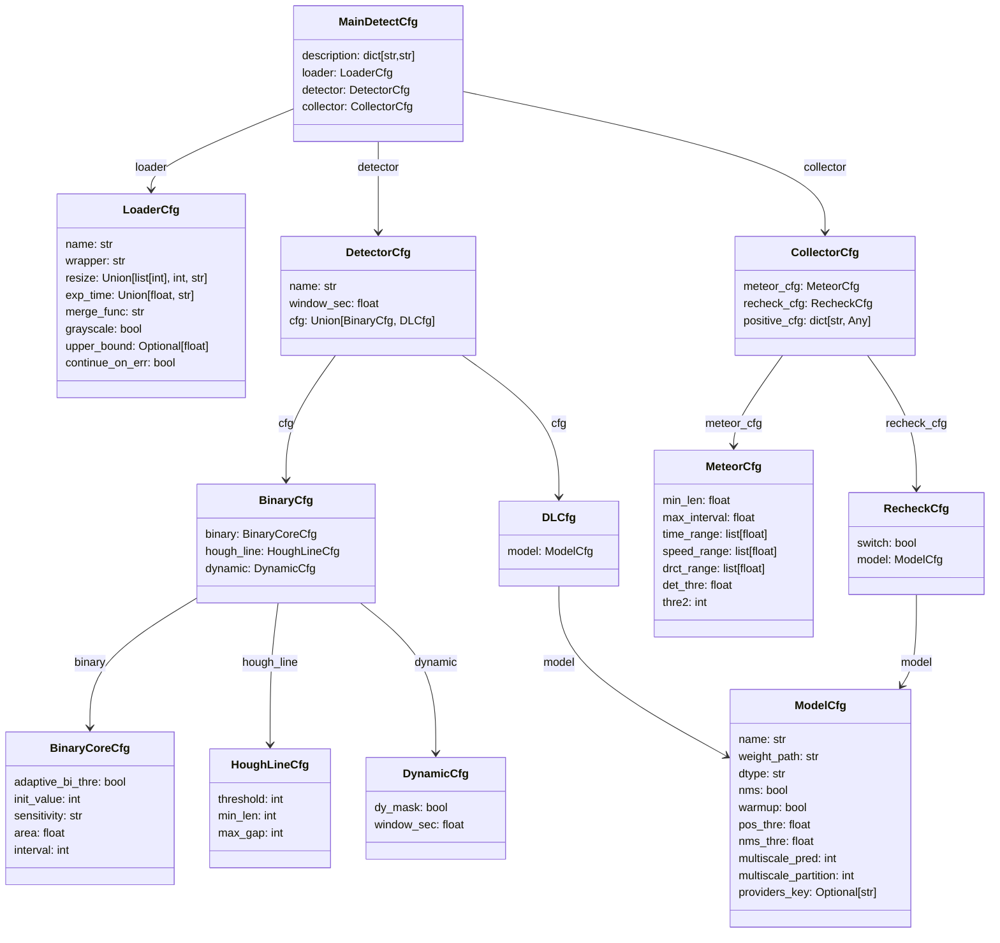
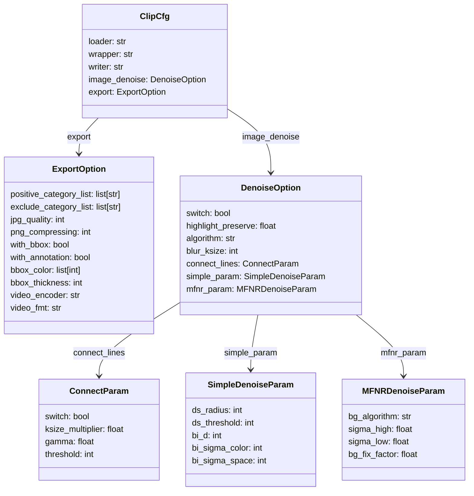

# Configuration Document

<center>Language: English | <a href="./config-doc-cn.md">简体中文</a> </center>

`MetDetPy` and `ClipToolkit` load runtime parameters from JSON configuration files. Preset configs usually work well, but tuning parameters can improve results for specific videos or setups. This document explains the configuration fields used by both tools so you can adapt loader settings, detection parameters, collector filters, and export/denoise options.

⚠️ When editing configuration files, ensure the JSON format is valid; otherwise the program will raise errors when loading the config.

## Menu

- [Detection configuration (MetDetPy)](#detection-configuration)
- [Clip configuration (ClipToolkit)](#clip-configuration)

## Detection configuration

### Overview

A detection config is a JSON file consisting of four main sections: a descriptive text (`description`), the video loader (`loader`), the detector (`detector`) and the collector (`collector`). Example presets are stored in the `../config` folder. It is recommended to open `../config/m3det_normal.json` while reading this document.

The structure (high level) is:



### Description

This section is used to describe the preset name and a short introduction. Frontend applications (for example Meteor Master >= 3.6.0) can display these fields. The detection logic itself does not use this section.

Example:

```json
"description": {
    "preset_name": "Configuration name",
    "intro": "A short description",
}
```

If you want different Chinese/English displays, you can provide language-specific keys:

```json
"description": {
    "preset_name_cn": "M3Det-通用",
    "preset_name_en": "M3Det-general",
    "intro_cn": "自适应检测器，适用于多数检测场景。",
    "intro_en": "Adaptive meteor detector. Suitable for most detection scenarios."
}
```

### Loader

The `loader` section controls video input and pre-processing. Example:

```json
"loader": {
    "name": "ThreadVideoLoader",
    "wrapper": "OpenCVVideoWrapper",
    "resize": 960,
    "exp_time": "auto",
    "upper_bound": 0.5,
    "merge_func": "max",
    "grayscale": true
}
```

Fields:

|Field|Type|Description|Recommended|
|---|---|---|---|
|`name`|str|Loader implementation. Options: `"VanillaVideoLoader"`, `"ThreadVideoLoader"`, `"ProcessVideoLoader"`. `"ThreadVideoLoader"` is generally recommended for stability and performance.|`"ThreadVideoLoader"`|
|`wrapper`|str|Underlying video wrapper/backend. Currently supports `"OpenCVVideoWrapper"` and `"PyAVVideoWrapper"`.|`"OpenCVVideoWrapper"`|
|`resize`|int, array, str|Target resolution for detection. An integer sets the long side length (e.g. `960`) and preserves aspect ratio; a string like `"960:540"` or `"960x540"` or a list `[960,540]` is also accepted.|`960`|
|`exp_time`|float or str (`"auto"`,`"slow"`,`"real-time"`)|Exposure time per frame in seconds. For classic detectors, `"auto"` lets the program estimate exposure from the clip. Use `"real-time"` when exposures match frame spacing. You may also provide a float value in seconds.|`"auto"` (line detectors) / `0.5` (MLDetector)|
|`upper_bound`|float (optional)|Upper bound used by `"auto"` exposure estimation. Optional.|`0.5`|
|`merge_func`|str|How to merge multiple source frames when actual exposure spans multiple frames. Options: `"max"`, `"m3func"`, `"mix_max_median_stacker"`. `"max"` is recommended for meteors.|`"max"`|
|`grayscale`|bool|Whether to convert frames to grayscale on load. Must be `true` for line-based detectors; for deep-learning detectors use `false`.|`true` (line) / `false` (ML)|

Notes:
1. `"ProcessVideoLoader"` is experimental, not fully tested, and is not compatible with macOS — avoid in production.
2. Why specify exposure time? Some camera outputs have exposure durations that do not match FPS (e.g. 4k60p with 1/20s exposure, frames only change every 3 samples). Supplying the real exposure improves both speed and detection accuracy.

### Detector

The `detector` section sets which detector to use, the sliding window length, and detector-specific parameters (binary thresholds, Hough parameters, etc.).

Example (line detector):

```json
"detector": {
    "name": "M3Detector",
    "window_sec": 1,
    "cfg": {
        "binary": {
            "adaptive_bi_thre": true,
            "init_value": 7,
            "sensitivity": "normal",
            "area": 0.1,
            "interval": 2
        },
        "hough_line": {
            "threshold": 10,
            "min_len": 10,
            "max_gap": 10
        },
        "dynamic": {
            "dy_mask": true,
            "dy_gap": 0.05,
            "fill_thre": 0.6
        }
    }
}
```

Example (deep-learning detector):

```json
"detector": {
    "name": "MLDetector",
    "window_sec": 1,
    "cfg": {
        "model": {
            "name": "YOLOModel",
            "weight_path": "./weights/yolov5s.onnx",
            "dtype": "float32",
            "nms": true,
            "warmup": true,
            "pos_thre": 0.25,
            "nms_thre": 0.45
        }
    }
}
```

Explanation of detector fields:

|Field|Type|Description|Recommended|
|---|---|---|---|
|`name`|str|Detector name: `"ClassicDetector"`, `"M3Detector"` (line-based), or `"MLDetector"` (deep-learning). Line detectors are sensitive and fast but produce more false positives; ML detectors are more robust but computationally heavier.|`"M3Detector"` / `"MLDetector"`|
|`window_sec`|int,float|Sliding window length (seconds). Typically around `1` second.|`1`|
|`cfg`|-|Detector-specific configuration (see below).|(see below)|

For line detectors, `cfg` contains `binary`, `hough_line`, and `dynamic` entries. For ML detectors, `cfg` contains `model`.

Summary table (key parameters):

<table>
    <tr>
        <td><b>Section</b></td>
        <td><b>Parameter</b></td>
        <td><b>Type</b></td>
        <td><b>Description</b></td>
        <td><b>Recommended</b></td>
    </tr>
    <tr>
        <td rowspan="5">binary</td>
        <td>adaptive_bi_thre</td>
        <td>bool</td>
        <td>Enable adaptive binary threshold estimation based on sampled SNR.</td>
        <td>true</td>
    </tr>
    <tr>
        <td>init_value</td>
        <td>int</td>
        <td>Initial binary threshold used when adaptive is off.</td>
        <td>5</td>
    </tr>
    <tr>
        <td>sensitivity</td>
        <td>str</td>
        <td>Sensitivity mapping used by the adaptive threshold estimator.</td>
        <td>normal</td>
    </tr>
    <tr>
        <td>area</td>
        <td>float</td>
        <td>Sampling area ratio for adaptive estimation. Range [0,1]. Recommended 0.05–0.2; invalid values fall back to full-image sampling.</td>
        <td>0.1</td>
    </tr>
    <tr>
        <td>interval</td>
        <td>int</td>
        <td>Estimation interval (frames). Too frequent estimation increases cost; too infrequent may lag behind SNR changes.</td>
        <td>2</td>
    </tr>
    <tr>
        <td rowspan="3">hough_line</td>
        <td>hough_threshold</td>
        <td>int</td>
        <td>Threshold used for Hough line detection (see OpenCV docs).</td>
        <td>10</td>
    </tr>
    <tr>
        <td>min_len</td>
        <td>int</td>
        <td>Minimum line length.</td>
        <td>10</td>
    </tr>
    <tr>
        <td>max_gap</td>
        <td>int</td>
        <td>Maximum allowed gap between line segments.</td>
        <td>10</td>
    </tr>
    <tr>
        <td rowspan="3">dynamic</td>
        <td>dy_mask</td>
        <td>bool</td>
        <td>Enable dynamic masking to suppress persistent bright-region responses (reduces FP near stars).</td>
        <td>true</td>
    </tr>
    <tr>
        <td>dy_gap</td>
        <td>float</td>
        <td>Dynamic gap factor: reduces `max_gap` when many responses exist. For example, `0.05` decays `max_gap` to 0 when potential meteor area > 0.05.</td>
        <td>0.05</td>
    </tr>
    <tr>
        <td>fill_thre</td>
        <td>float</td>
        <td>Maximum hollow ratio allowed when forming a line. Set to 0 to disable. ⚠️ Deprecated.</td>
        <td>0.6</td>
    </tr>
    <tr>
        <td>model</td>
        <td>-</td>
        <td>-</td>
        <td>See the <a href="#model">Model</a> section.</td>
        <td>-</td>
    </tr>
</table>

### Collector

The `collector` controls filtering/collection rules and recheck (re-verification) options. Example:

```json
"collector": {
    "meteor_cfg": {
        "min_len": 20,
        "max_interval": 5,
        "time_range": [0, 8],
        "speed_range": [3, 12],
        "drct_range": [0, 0.6],
        "det_thre": 0.5,
        "thre2": 2048
    },
    "recheck_cfg": {
        "switch": true,
        "model": {
            "name": "YOLOModel",
            "weight_path": "./weights/yolov5s_v2.onnx",
            "dtype": "float32",
            "nms": true,
            "warmup": true,
            "pos_thre": 0.25,
            "nms_thre": 0.45,
            "multiscale_pred": 2,
            "multiscale_partition": 2
        },
        "save_path": ""
    },
    "positive_cfg": {
        "positive_cates": ["METEOR", "RED_SPRITE"]
    }
}
```

This includes three parts: `meteor_cfg` (filters), `recheck_cfg` (re-verification), and `positive_cfg` (positive categories).

#### Meteor filters (`meteor_cfg`)

Set filters for length, interval, duration, speed, linearity and score thresholds.

|Field|Type|Description|Recommended|
|---|---|---|---|
|`min_len`|int|Minimum length (px) to start recording a meteor.|20|
|`max_interval`|int|Maximum allowed interval (s) between responses before a meteor/group is considered finished.|5|
|`time_range`|array|Allowed duration range (s).|[0,8]|
|`speed_range`|array|Allowed speed range. Calculated as: (distance(px)/time(s)) / (long_side(px)) * 100 — i.e. percentage of long-side per second. Example `[3,12]` means 3%–12% per second.|[3,12]|
|`drct_range`|array|Allowed linearity variance. Closer to 0 means more straight.|[0,0.6]|
|`det_thre`|float|Score threshold to consider a meteor as positive (0–1).|0.5|
|`thre2`|int|Max allowed squared distance between responses for grouping. Increase if trajectory has multiple discrete responses. ⚠️ This uses runtime resolution as reference; large changes in resolution can affect results.|2048|

⚠️ Filters are designed to be tolerant: scores decay gradually outside bounds rather than abruptly becoming zero.

#### Recheck (`recheck_cfg`)

Recheck (introduced in v2.0.0) runs an additional verification step using the time range and location proposed by the main detector. Fields:

|Field|Type|Description|Recommended|
|---|---|---|---|
|`switch`|bool|Enable recheck.|true|
|`model`|-|See the Model section.|-|
|`save_path`|str|Path to save recheck images. Empty means do not save.|`""`|

#### Positive configuration (`positive_cfg`)

Introduced in v2.2.0, allows specifying categories considered as positive samples.

|Field|Type|Description|Recommended|
|---|---|---|---|
|`positive_cates`|list|List of categories accepted as positive.|[`"METEOR"`,`"RED_SPRITE"`]| 

### Model

Deep learning models can be configured under a detector's `cfg.model` and under `collector.recheck_cfg.model`.

Example:

```json
"model": {
    "name":"YOLOModel",
    "weight_path": "./weights/yolov5s.onnx",
    "dtype": "float32",
    "nms": true,
    "warmup": true,
    "pos_thre": 0.25,
    "nms_thre": 0.45,
    "multiscale_pred":2,
    "multiscale_partition":2
}
```

|Field|Type|Description|Recommended|
|---|---|---|---|
|`name`|str|Model type; currently only YOLO format (`"YOLOModel"`) is implemented.|`"YOLOModel"`|
|`weight_path`|str|Path to model weights (relative to project or absolute). A YOLOv5s `.onnx` is included. The label file is `../global/class_name.txt`.|`"./weights/yolov5s.onnx"`|
|`dtype`|str|Input dtype. Use correct dtype for quantized models. Supported: `"float32"`, `"float16"`.|`"float32"`|
|`nms`|bool|Whether to run NMS. Set `false` if the model already includes NMS to speed up inference.|`true`|
|`warmup`|bool|Whether to run a warmup pass before real inference.|`true`|
|`pos_thre`|float|Positive sample score threshold (0–1).|0.25|
|`nms_thre`|float|NMS IoU threshold.|0.45|
|`multiscale_pred`|int|Run multi-scale detection when >0. Larger values increase compute and false positives; typically 1 or 2.|1 / 2|
|`multiscale_partition`|int|Partition number per dimension for multi-scale detection. Typical value: 2.|2|

## Clip configuration

`ClipToolkit` controls how clips and images are exported; default config is at `../global/clip_cfg.json`. The structure is also described in `MetLib/metstruct.py`.

Key fields:

|Field|Type|Description|Recommended|
|---|---|---|---|
|`loader`|str|Loader implementation|`"ThreadVideoLoader"`|
|`wrapper`|str|Video backend wrapper|See above|
|`writer`|str|Video writer backend, e.g. `OpenCVVideoWriter`, `PyAVVideoWriter`.|`"PyAVVideoWriter"`|
|`image_denoise`|DenoiseOption|Image denoise options|See below|
|`export`|ExportOption|Export options|See below|

Class diagram (excerpt):



### Image denoise options

Controls post-processing (denoising, connecting broken traces) when exporting images.

Key fields and recommended defaults are documented in `../global/clip_cfg.json`. Important items:

|Field|Type|Description|Recommended|
|---|---|---|---|
|`switch`|bool|Enable image denoise by default. Even if `false`, you can enable denoise per-run with the `--denoise` CLI flag.|true|
|`highlight_preserve`|float|High-light preservation threshold to protect meteor highlights from over-denoising.|0.9|
|`algorithm`|str|Denoise algorithm: `"simple"` or `"mfnr-mix"` (multi-frame mixing).|`"simple"`|
|`blur_ksize`|int|Gaussian kernel size used for mask estimation.|31|

`connect_lines` (connect broken traces):

|Field|Type|Description|Recommended|
|---|---|---|---|
|`switch`|bool|Attempt to connect broken traces during denoise.|true|
|`ksize_multiplier`|float|Multiplier for `blur_ksize` to determine kernel used for connecting.|1.5|
|`gamma`|float|Gamma used when transforming the connection mask.|1.0|
|`threshold`|int|Threshold for the connection mask.|30|

`simple_param` (single-frame denoise):

|Field|Type|Description|Recommended|
|---|---|---|---|
|`ds_radius`|int|Median filter radius for dust-and-scratch removal.|10|
|`ds_threshold`|int|Brightness difference threshold for dust removal.|20|
|`bi_d`|int|Diameter for bilateral filter neighborhood.|10|
|`bi_sigma_color`|float|Color sigma for bilateral filter.|15|
|`bi_sigma_space`|float|Spatial sigma for bilateral filter.|6|

`mfnr_param` (multi-frame denoise):

|Field|Type|Description|Recommended|
|---|---|---|---|
|`bg_algorithm`|str|Background estimator for multi-frame denoise: `"median"`, `"med-of-med"`, `"sigma-clipping"`, `"mean"`.|`"mean"`|
|`sigma_high`|float|Sigma parameter for sigma-clipping upper bound.|3.0|
|`sigma_low`|float|Sigma parameter for sigma-clipping lower bound.|3.0|
|`bg_fix_factor`|float|Correction factor for background estimation.|1.5|

### Export options

|Field|Type|Description|Recommended|
|---|---|---|---|
|`positive_category_list`|list|Categories to export as positives.|[`"METEOR"`,`"RED_SPRITE"`]| 
|`exclude_category_list`|list|Categories to exclude by default.|[]|
|`with_bbox`|bool|Include bounding boxes in exports.|false|
|`with_annotation`|bool|Include annotation files in exports.|false|
|`bbox_color`|list|BBox color in BGR order.|[0,0,255]|
|`bbox_thickness`|int|BBox thickness.|2|
|`video_encoder`|str|Encoder for PyAV writer (when using `PyAVVideoWriter`).|`"libx264"`|
|`video_fmt`|str|Pixel format for exported video (PyAV writer).|`"yuv420p"`|
