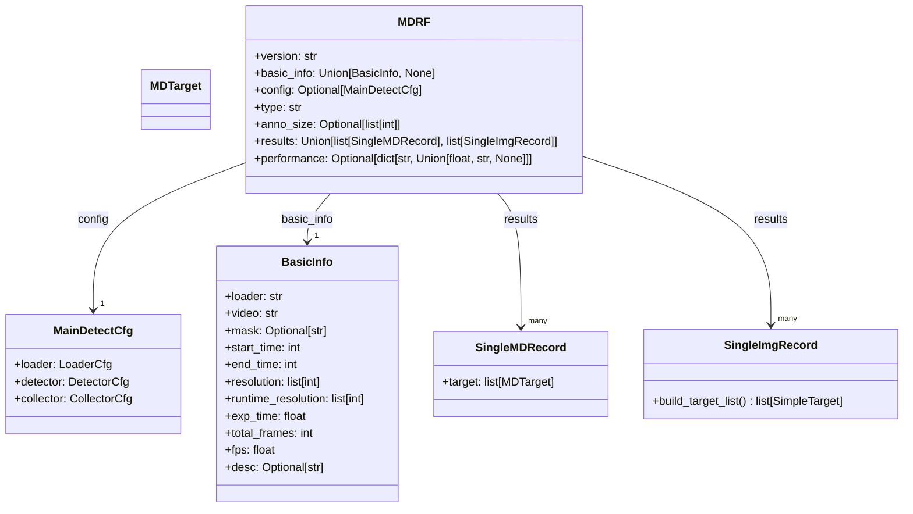
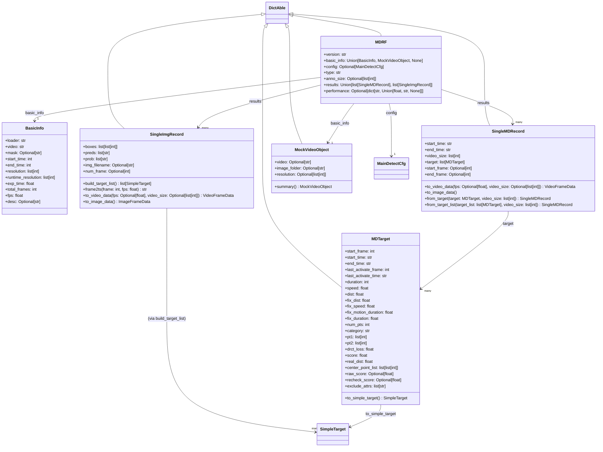
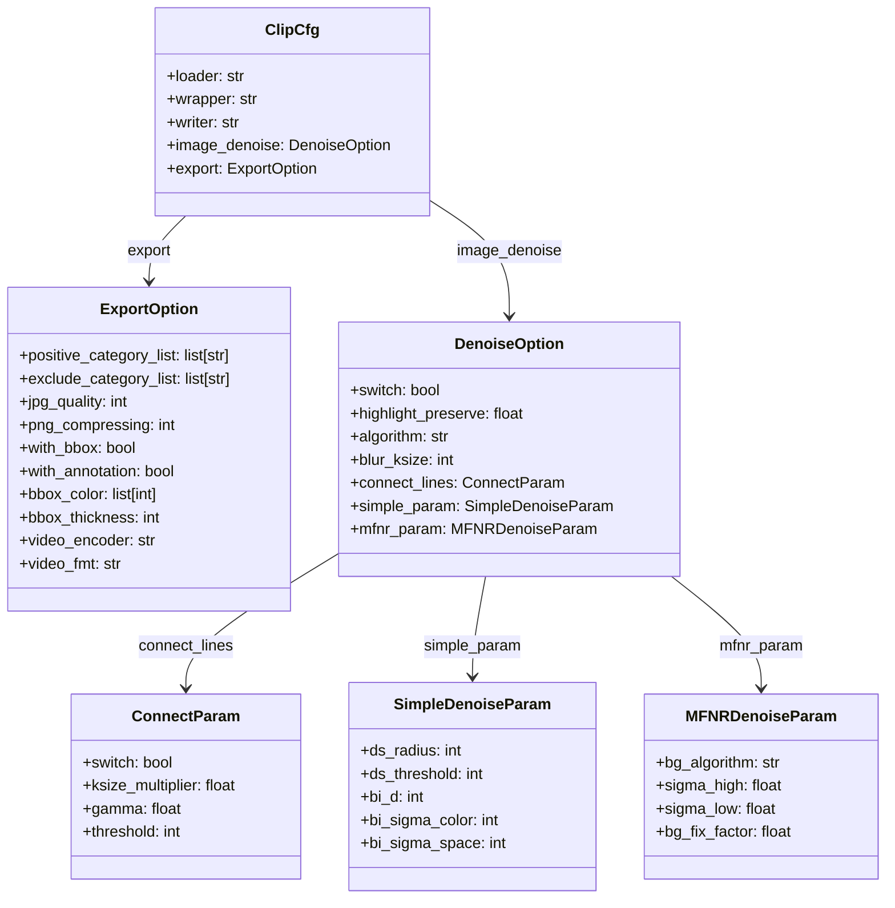

# 数据格式文档

<center> 语言：<a href="./data-format.md">English</a> | 中文版 </center>

从 `v2.2.0` 开始， `MetDetPy` 正式引入流星检测记录格式(Meteor Detection Recording Format, MDRF ) 作为 `MetDetPy` 项目的标准格式。 `MDRF` 文件是包含流星检测结果，表现和标注等信息的结构化文本，并以 `JSON` 序列化。 `MDRF` 文件可以从检测工具生成或手动标注构建，并可以在不同 MetDetPy 工具间的流转。

本文档对 MDRF 的结构做释义说明。若需进一步确认，可以阅读代码中[MDRF 的定义](../MetLib/metstruct.py#L351)确认具体格式。



## MDRF

MDRF 的定义如下：

```py
@dataclasses.dataclass
class MDRF(DictAble):
    version: str
    basic_info: Union[BasicInfo, MockVideoObject, None]
    config: Optional[MainDetectCfg]
    type: str
    anno_size: Optional[list[int]]
    results: Union[list[SingleMDRecord], list[SingleImgRecord]]
```

各键值以及释义如下：

| 键      | 值类型 | 释义                 |
| ------- | ------ | -------------------- |
| version | str    | 标注对应的`MetDetPy`版本。 |
| basic_info | [BasicInfo](#BasicInfo) | 包含源视频的基本信息，用于确定视频片段，蒙版和曝光参数。|
| config | [MainDetectCfg] | 本次检测使用的配置，格式参考 [MainDetectCfg](./config-doc-cn.md)。|
| type | str | 注明 MDRF 的性质（可选属于标注的基本事实`"ground-truth"`或 MetDetpy 的预测`"prediction"`）|
| anno_size | list[int] | 标注或预测的分辨率。|
| results | Union[list[SingleMDRecord], list[SingleImgRecord]] | 检测结果的列表。根据识别的图像序列或者是视频，可以是 [SingleMDRecord](#SingleMDRecord) 格式或者 `SingleImgRecord` 格式的列表。|


## BasicInfo

BasicInfo 的定义如下：

```py
@dataclasses.dataclass
class BasicInfo(DictAble):
    loader: str
    video: Optional[str]
    mask: Optional[str]
    start_time: int
    end_time: int
    resolution: list[int]
    runtime_resolution: list[int]
    exp_time: float
    total_frames: int
    fps: float
```

各键值以及释义如下：
| 键      | 值类型 | 释义                 |
| ------- | ------ | -------------------- |
| loader | str | 视频检测器 loader名称。|
| video | str| 待检测视频的路径，可能是相对路径。|
| mask | str| 遮罩图片的路径，可能是相对路径。|
| start_time | int | 待检测片段的开始时间(单位：ms)。|
| end_time | int | 待检测片段的结束时间(单位：ms)。|
| resolution | list[int] | 输入视频的分辨率信息。|
| runtime_resolution | list[int] | 实际运行时使用的分辨率信息。|
| exp_time | float | 运行时实际使用的单帧曝光时长（单位: s）。|
| total_frames | int | 运行时实际检测的总帧数。|
| fps | float | 待检测视频的fps。|

## SingleMDRecord

SingleMDRecord 定义了一个视频流星片段包含的必要信息，一个流星片段可能包含多个目标。其定义如下：

```py
class SingleMDRecord(DictAble):
    start_time: str
    end_time: str
    video_size: list[int]
    target: list[MDTarget]
    start_frame: Optional[int] = None
    end_frame: Optional[int] = None
```

各键值以及释义如下：

| 键      | 值类型 | 释义                 |
| ------- | ------ | -------------------- |
| start_time | str | 开始时间，以`HH:MM:SS.xxx`格式表示。|
| end_time | str | 结束时间，以`HH:MM:SS.xxx`格式表示。|
| video_size | list[int] | 视频实际分辨率尺寸。|
| target | list[MDTarget] | 包含的所有候选目标的列表。|
| start_frame | Optional[int] | 开始帧数，如果是标注，则该项可省略。|
| end_frame | Optional[int] | 结束帧数，如果是标注，则该项可省略。|

## MDTarget

`MDTarget` 定义了一个目标的


```py
@dataclasses.dataclass
class MDTarget(DictAble):
    """Standard meteor detect target class.
    
    MDTarget describe a single result (a meteor, sprite), including its 

    Args:
        object (_type_): _description_
    """
    start_frame: int
    start_time: str
    end_time: str
    last_activate_frame: int
    last_activate_time: str
    duration: int
    speed: float
    dist: float
    fix_dist: float
    fix_speed: float
    fix_motion_duration: float
    fix_duration: float
    num_pts: int
    category: str
    pt1: list[int]
    pt2: list[int]
    drct_loss: float
    score: float
    real_dist: float
    center_point_list: list[list[int]] = dataclasses.field(
        default_factory=lambda: [])
    raw_score: Optional[float] = None
    recheck_score: Optional[float] = None
    exclude_attrs: list[str] = dataclasses.field(
        default_factory=lambda: ["center_point_list"])
```





裁剪参数配置



