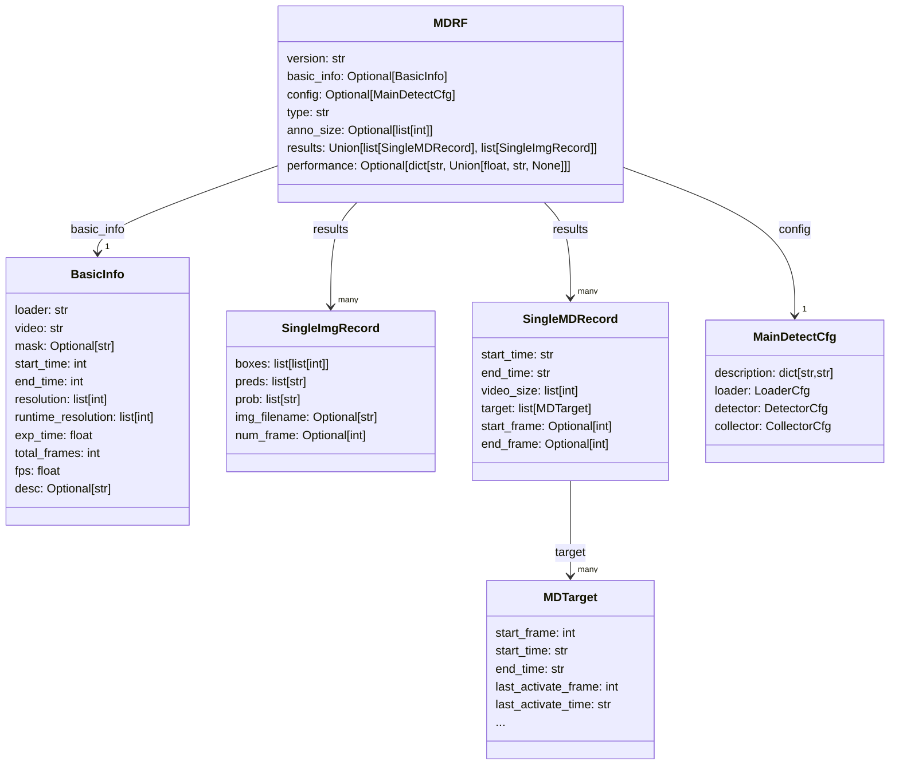

# 数据格式文档

 语言：<a href="./data-format.md">English</a> | <b>简体中文</b> 

## Menu

[流星检测记录格式(MDRF)](#流星检测记录格式(MDRF))

## 流星检测记录格式(MDRF)
`MDRF` (Meteor Detection Recording Format, MDRF) 是 `MetDetPy` 工程文件的标准格式。 `MDRF` 文件是包含流星检测结果，表现和标注等信息的结构化文本，并以 `JSON` 序列化。 `MDRF` 文件可以从检测工具生成或手动标注构建，并可以在不同 MetDetPy 工具间的流转。可以阅读代码中[MDRF 的定义](../MetLib/metstruct.py#L351)确认具体定义。

MDRF的可视化结构如下：

MDRF 的各键值以及释义如下：

| 键      | 值类型 | 释义                 |
| ------- | ------ | -------------------- |
| version | `str`    | 标注对应的`MetDetPy`版本。 |
| basic_info | [Optional[BasicInfo]](#BasicInfo) | 包含源视频的基本信息，用于确定视频片段，蒙版和曝光参数。如果不是视频检测结果，则该项为空。|
| config | `MainDetectCfg` | 本次检测使用的配置，格式参考 [MainDetectCfg](./config-doc-cn.md)。|
| type | `str` | 注明 MDRF 的性质（可选属于标注的基本事实`"ground-truth"`或 MetDetpy 的预测`"prediction"`）|
| anno_size | `list[int]` | 标注或预测的分辨率。|
| results | `Union[list[SingleMDRecord], list[SingleImgRecord]]` | 检测结果的列表。根据识别的图像序列或者是视频，可以是 [SingleMDRecord](#SingleMDRecord) 格式或者 [SingleImgRecord](#singleimgrecord) 格式的列表。|

### BasicInfo

BasicInfo 包含源视频的基本信息。其各键值以及释义如下：
| 键      | 值类型 | 释义                 |
| ------- | ------ | -------------------- |
| loader | `str` | 视频检测器 loader名称。|
| video | `str` | 待检测视频的路径，可能是相对路径。|
| mask | `str`| 遮罩图片的路径，可能是相对路径。|
| start_time | `int` | 待检测片段的开始时间(单位：ms)。|
| end_time | `int` | 待检测片段的结束时间(单位：ms)。|
| resolution | `list[int]` | 输入视频的分辨率信息。|
| runtime_resolution | `list[int]` | 实际运行时使用的分辨率信息。|
| exp_time | `float` | 运行时实际使用的单帧曝光时长（单位: s）。|
| total_frames | `int` | 运行时实际检测的总帧数。|
| fps | `float` | 待检测视频的fps。|

### SingleMDRecord

SingleMDRecord 对应一个视频片段的记录信息，如起止时间及片段中的所有目标信息等。其各键值以及释义如下：

| 键      | 值类型 | 释义                 |
| ------- | ------ | -------------------- |
| start_time | `str` | 开始时间，以`HH:MM:SS.xxx`格式表示。|
| end_time | `str` | 结束时间，以`HH:MM:SS.xxx`格式表示。|
| video_size | `list[int]` | 视频实际分辨率尺寸。|
| target | `list[MDTarget]` | 包含的所有候选目标的列表。每个 `MDTarget` 均包含了对应目标的所有属性，详见[MDTarget](#MDTarget)。|
| start_frame | `Optional[int]` | 开始帧数，如果是标注，则该项可省略。|
| end_frame | `Optional[int]` | 结束帧数，如果是标注，则该项可省略。|

### SingleImgRecord

SingleImgRecord 对应图像检测时一张/一帧图像的必要信息。其各键值以及释义如下：

| 键      | 值类型 | 释义                 |
| ------- | ------ | -------------------- |
| boxes | `list[list[int]]` | 检测框列表 |
| preds | `list[str]` | 检测结果类别列表 |
| prob | `list[str]` | 检测结果得分列表 |
| img_filename| `Optional[str]` | 源图像名称。如果是从延时视频中读取的图像，该项为空。|
| num_frame | `Optional[int]` | 源延时视频对应的帧。如果从图像序列读取的图像，该项为空。|

## MDTarget

MDTarget 定义视频片段中单个目标的所有属性信息。其各键值以及释义如下：

| 键      | 值类型 | 释义                 |
| ------- | ------ | -------------------- |
| start_frame | `int` | 起始帧数 |
| start_time | `str` | 起始时间戳，格式为"HH:MM:SS.ms"。|
| end_time | `str` | 目标运动结束时间戳，格式为"HH:MM:SS.ms"。|
| last_activate_frame | `int` | 目标响应结束时的帧数。[[1]](#注[1]) |
| last_activate_time | `str` | 目标响应结束时的时间戳，格式为"HH:MM:SS.ms"。|
| duration | `int` | 该(流星)片段的完整持续帧数。|
| speed | `float` | 目标的运动速度，单位为像素/帧。|
| dist | `float` | 目标在检测分辨率下的最大长度，单位为像素。|
| fix_dist | `float` | 目标归一化长度。无量纲，数值为 `目标最大长度 / 图像长边长度 * 100`。|
| fix_motion_duration | `float` | 目标运动的总时长，单位为 s。数值为 `目标运动总帧数 / fps`。|
| fix_duration | `float` | 目标完整持续时长，单位为 s。数值为 `完整持续帧数 / fps`。|
| fix_speed | `float` | 目标归一化速度，单位为$s^{-1}$。数值为 `目标归一化长度 / 目标运动的总时长`。|
| num_pts | `int` | 目标被检测到的坐标点数。|
| category | `str` | 目标所属的类别标签。|
| pt1 | `list[int]` | 目标运动起始点坐标。 |
| pt2 | `list[int]` | 目标运动结束点坐标。 |
| drct_loss | `float` | 目标运动方向方差。 |
| score | `float` | 目标最终的置信度得分，代表目标的属于正样本的概率，范围为[0,1]。 |
| real_dist | `float` | 目标在原始分辨率下的真实长度，单位为像素。 |
| raw_score | `Optional[float]` | 主检测器预估的目标置信度， 代表目标从运动属性评估属于正样本的概率，范围为[0,1]。如果结果不是主检测器检出的，则该项结果为None。|
| recheck_score | `Optional[float]` | 重校验检测器预估的目标置信度， 代表目标从最终视觉效果评估属于正样本的概率，范围为[0,1]。如果重校验检测器没有检出该结果，则该项结果为None。 |

###### 注[1]
目标响应结束时间通常等于或晚于运动结束时间。例如，一个0s开始的流星运动了1s，但余迹继续存在了0.5s，那么持续结束时间将在1.5s。