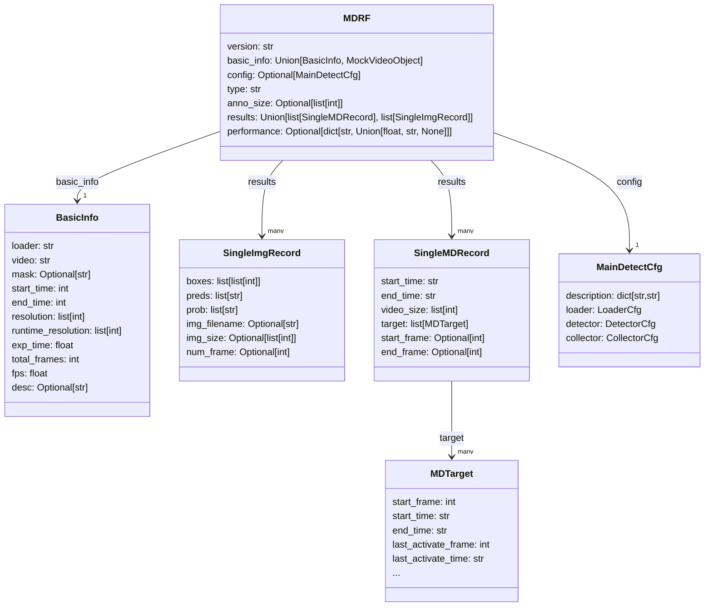

# Data Format Documentation

 Language: English | <a href="./data-format-cn.md">简体中文</a> 

## Menu

[Meteor Detection Recording Format (MDRF)](#meteor-detection-recording-format-mdrf)

## Meteor Detection Recording Format (MDRF)
`MDRF` (Meteor Detection Recording Format) is the standard format used in the `MetDetPy` project. An `MDRF` file is a structured text containing meteor detection results, performance metrics and annotations, serialized as `JSON`. `MDRF` files can be produced by detection tools or assembled from manual annotations, and can be exchanged between different MetDetPy tools. See the [MDRF definition in code](../MetLib/metstruct.py#L351) for the precise schema.

The visual structure of an MDRF is shown below:

Keys in an MDRF and their meanings:

| Key | Type | Description |
| --- | ---- | ----------- |
| version | `str` | The MetDetPy version associated with this annotation. |
| basic_info | [Optional[BasicInfo]](#basicinfo) | Basic information about the source video. If results are not from a video, this field may be omitted. |
| config | `MainDetectCfg` | The configuration used for the detection run. See [MainDetectCfg](./config-doc.md). |
| type | `str` | The nature of the MDRF — e.g. ground-truth (`"ground-truth"`) or prediction (`"prediction"`). |
| anno_size | `list[int]` | The resolution used for annotation or prediction. |
| results | `Union[list[SingleMDRecord], list[SingleImgRecord]]` | The list of detection records. Depending on input, results are either a list of [SingleMDRecord](#singlemdrecord) or a list of [SingleImgRecord](#singleimgrecord). |

### BasicInfo

`BasicInfo` contains metadata about the source video. Keys and meanings:

| Key | Type | Description |
| --- | ---- | ----------- |
| loader | `str` | The loader name used by the detector. |
| video | `str` | Path to the source video (may be relative). |
| mask | `Optional[str]` | Path to a mask image (may be relative). If no mask is used, this field is `None`. |
| start_time | `int` | Segment start time in milliseconds. |
| end_time | `int` | Segment end time in milliseconds. |
| resolution | `list[int]` | Input video resolution. |
| runtime_resolution | `list[int]` | Resolution used at runtime. |
| exp_time | `float` | Exposure time per frame used at runtime (seconds). |
| total_frames | `int` | Number of frames processed in the run. |
| fps | `float` | Frames per second of the source video. |

### SingleMDRecord

`SingleMDRecord` corresponds to a recorded video segment with its start/end timestamps and all targets detected in the segment. Keys and meanings:

| Key | Type | Description |
| --- | ---- | ----------- |
| start_time | `str` | Segment start time in `HH:MM:SS.xxx` format. |
| end_time | `str` | Segment end time in `HH:MM:SS.xxx` format. |
| video_size | `list[int]` | Actual video resolution used. |
| target | `list[MDTarget]` | List of target objects detected in the segment. See [MDTarget](#mdtarget). |
| start_frame | `Optional[int]` | Optional start frame number (may be omitted for annotations). |
| end_frame | `Optional[int]` | Optional end frame number (may be omitted for annotations). |

### SingleImgRecord

`SingleImgRecord` represents a detection result for a single image/frame. Keys and meanings:

| Key | Type | Description |
| --- | ---- | ----------- |
| boxes | `list[list[int]]` | List of bounding boxes. |
| preds | `list[str]` | Predicted class labels. |
| prob | `list[str]` | Prediction probabilities/scores. |
| img_filename | `Optional[str]` | Source image filename. If read from a time-lapse video this field may be empty. |
| img_size | `Optional[list[int]]` | Image dimensions `[width, height]`. If not specified, this field is `None`. |
| num_frame | `Optional[int]` | Corresponding frame index in the source time-lapse video. If images came from a directory, this may be empty. |

## MDTarget

`MDTarget` describes all attributes for a single target within a video segment. Keys and meanings:

| Key | Type | Description |
| --- | ---- | ----------- |
| start_frame | `int` | Start frame index. |
| start_time | `str` | Start timestamp in `HH:MM:SS.ms` format. |
| end_time | `str` | End timestamp when motion ends, `HH:MM:SS.ms`. |
| last_activate_frame | `int` | Frame index when target activation finishes.[[1]](#note-1) |
| last_activate_time | `str` | Time when activation finishes, `HH:MM:SS.ms`. |
| duration | `int` | Total duration in frames for this (meteor) segment. |
| speed | `float` | Motion speed in pixels/frame. |
| dist | `float` | Maximum length in pixels at detection resolution. |
| fix_dist | `float` | Normalized length: `max_length / image_long_side * 100`. Dimensionless. |
| fix_motion_duration | `float` | Motion duration in seconds: `motion_frames / fps`. |
| fix_duration | `float` | Full duration in seconds: `duration_frames / fps`. |
| fix_speed | `float` | Normalized speed in s^{-1}: `fix_dist / motion_total_time`. |
| num_pts | `int` | Number of detected coordinate points for the target. |
| category | `str` | Category label of the target. |
| pt1 | `list[int]` | Start point coordinates. |
| pt2 | `list[int]` | End point coordinates. |
| drct_loss | `float` | Direction variance of the motion. |
| score | `float` | Final confidence score for the target (range [0,1]). |
| real_dist | `float` | Real length in original resolution (pixels). |
| raw_score | `Optional[float]` | Raw confidence estimated by the main detector (range [0,1]). `None` if the result wasn't detected by the main detector. |
| recheck_score | `Optional[float]` | Recheck detector confidence (range [0,1]). `None` if recheck detector did not detect this target. |
| center_point_list | `list[list[int]]` | List of center point coordinates for the target motion trajectory. This field is excluded from serialization by default (controlled by `exclude_attrs`). |
| relative_brightness | `Optional[float]` | Relative brightness value of the target, dimensionless, used to represent the sample's brightness relative to the background. Only included in positive samples after recheck. |
| aesthetic_score | `Optional[float]` | Aesthetic score of the target, dimensionless, used to characterize the sample's visual appeal. Calculated by combining the sample's length, brightness, and confidence. Only included in positive samples after recheck. |

###### Note [1]
The activation end time is typically equal to or later than the motion end time. For example, if a meteor starts at 0.0s, moves for 1.0s, and its afterglow remains for 0.5s, the `last_activation_time` would be 1.5s.
