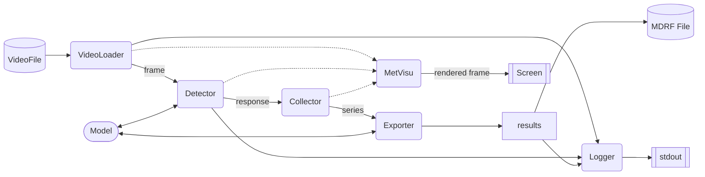

# MetDetPy 开发文档【WIP】

该文档介绍MetDetPy目前的开发框架。

## MetDetPy 架构

MetDetPy整体框架如下图：

```mermaid
  graph LR;
      vl(VideoLoader)--frame-->det(Detector)--response-->col(Collector)--series-->rechk(Exporter)-->results--->json[(MDRF File)];
      video[(VideoFile)]-->vl;
      model([Model])<-->det;
      model<-->rechk;
      vl-->lg(Logger);
      det-->lg;
      results-->lg;
      lg-->stdout[[stdout]];
      vl-.->mv(MetVisu);
      det-.->mv;
      col-.->mv;
      mv--rendered frame-->scr[[Screen]];
```

### 核心组件

其中，与检测相关核心组件主要包含一下3个部分：

* VideoLoader 视频加载器：用于视频加载和预处理，将编码的视频文件解码为帧序列，并执行帧预处理（如放缩，转灰度图像等），帧合并等操作，随后将结果送入检测器；
* Detector 检测器：用于初步检测疑似流星目标，在时间滑窗内检测所有帧并捕获亮度超过阈值的目标的运动，并将其运动信息整合为若干“响应”，送入收集器；
* Collector 收集器，将属于同一目标的“响应”整合为运动序列。待目标不再运动后进行整合，并送入导出器。
* Exporter 导出器，使用运动序列的统计特征和此期间的图像特征进行重新校验，判断目标分类，并规范化为最终的导出格式。

### 调试组件

与调试和日志相关的组件主要包含以下两个部分：

* Logger 日志工具，用于检测结果的分级日志输出，针对作为后端的场景做了一定优化，确保输出流可以被分条解析。
* MetVisu 可视化工具，用于可视化调试，将检测各个阶段中间状态展现到屏幕，便于观察各组件的运行情况。

### 次级组件

次级组件通常作为核心组件的一部分工作。部分次级组件可以被多个核心组件同时使用（并非共享）。目前的次级组件主要包含：

* Model 模型组件，提供了深度学习模型接入的能力。
* VideoWrapper 视频API封装组件，提供了封装底层视频加载API的能力，允许以统一的上层接口进行视频读取。

## VideoLoader 视频加载器
To be done..

## Detectors 检测器

Detector 是MetDetPy的核心组件。其主要在给定的时间窗内检测流星（及其他事件）。MetDetPy中不同算法的主要差异在检测器部分。
目前 MetDetPy 可用的算法主要有两种，即M3Det与DLDet。M3Det是基于直线检测的算法，通过图像处理和直线检测计算时间窗内的亮目标的运动轨迹。DLDet是基于目标检测的检测算法，通过直接使用目标检测模型检测图像，找到候选的运动目标。

目前MetDetPy中已实现的Detectors按照类型分为以下几种：

1. BaseDetector (AbstractBaseClass)
2. LineDetector (基于直线检测方法的通用基类)
3. ClassicDetector（复现uzanka的直线检测器）
4. M3Detector（基于最大值-均值差值的直线检测器）
5. MLDetector（基于深度学习检测方法的类）

### Detector的机制

#### 自适应阈值 (Adaptive Threshold)

#### 动态掩模 (Dynamic Mask)

## 流星收集器 Collector

收集器将检测器获取的响应进行收集，整合和统计。目前的收集器设计是两阶段的，即前置检查器（用于从视频中初步筛选片段和目标）与后置校验器（基于深度学习模型的图像分类器）。其中后置校验器是一个可选组件。

前置检查器主要从视频中获取和运动有关的信息，如持续时间，运动速度和运动模式等。该信息对于区分流星和卫星至关重要（由于大多数录制设备在暗光条件下的短曝光画质有损，卫星和流星保留的视觉特征很可能高度相似）。同时前置检查器还需要将面积类响应记录（尽管其不能识别出具体的类别，但应当具有将其从噪声和干扰中区分出的能力）。

后置检查器在前置获取的片段叠加图中检测若干已知类别，并给出校验和分类。通常来说，后置检查器可以显著降低误报。但由于监督学习的有限性，对于为出现在过训练集的大气现象，后置检查器很可能会无法给出置信的标签而忽略它们。

后置检查器通常会产生较大的计算开销，如果大量输入疑似片段，则会严重影响性能。因此，一种理想的组合是，前置检查器尽可能过滤掉高频出现且不期望被捕获的类别（如飞虫，卫星等），除非指明需要捕获它们；后置检查器则会从图像给出对目标更准确的分类。对于前置检查部分检测出，后置却忽略掉的部分，则应当作为独立的疑似目标输出。

## 可视化组件 MetVisu

MetVisu 组件用于在检测时创建实时窗口并展示必要信息。在算法的开发和调试阶段，用于观察算法运行时的检测情况。

### 可视化接口的设计

MetDetPy主框架中默认会将从视频加载器获取的帧和时间戳作为背景。为了渲染每一帧的检测情况，还需要 `detector` 和 `collector` 在运行时把“本帧需要绘制的内容”返回给 `MetVisu`。

当前的 `MetVisu` 采用纯运行时渲染：`display_a_frame(base_img, data_list)` 直接依据传入的 `data_list` 绘制。

#### data_list
`data_list` 是 `list[BaseVisuAttrs]`：渲染顺序保持为 `img` → `draw` → `text`，在同一类别内会按 `data_list` 的出现顺序绘制。

对象字段说明（以代码中的类型命名为准）：
* `ImgVisuAttrs`（img）：`name`、`img`、可选 `weight`/`color`
* `DrawRectVisu` / `DrawCircleVisu`（draw）：`name`、矩形用 `pair_list`、圆点用 `dot_list`，可选 `thickness`/`radius`/颜色
* `TextVisu`（text）：`name`、`text_list`；`TextColorPair` 的 `position/color` 可以不填，会沿用 `TextVisu` 的默认值（`TextVisu.position` 支持使用 `POSITION_MAP` 的字符串 key）

#### visu()

`visu()` 方法返回 `list[BaseVisuAttrs]`，描述“这一帧要画什么”。

渲染器会按 `data_list` 的类别顺序 `img` → `draw` → `text`，以及同一类别内的出现顺序来绘制。固定位置文字允许多条，但默认会绘制到同一坐标从而可能发生重叠；需要错开时请为每个 `TextColorPair` 显式提供 `position`。

5. 测量方法（定义，单位）
MetDetPy输出的主要测量值与流星筛选配置中使用的过滤参数相同。此处就现文档中未说明清楚的部分展开详细解释：

"start_frame": 开始帧
"start_time": 开始时间戳
"end_time": 结束时间戳
"end_frame" 结束帧
"duration": 流星的持续帧数。（单位：帧）
"dist": 流星在分析分辨率下的长度（单位：像素）。
"speed": 流星在分析分辨率下的运动速度。（单位：像素/帧）
"num_pts": 运动序列的总点数（单位：个）。该指标不建议直接用于作图。
"drct_loss": 构成流星运动序列的向量的方向方差（无单位统计值）。该值越小，说明该运动轨迹越接近直线。

注：上述部分统计参数是基于帧计算的结果，在可变帧的情况下检测阈值可能受到帧数的影响。因此，"duration"和"speed"的计算方法计划在下一发行版发生变化。因此，如果在作图期间升级了MetDetPy，可能造成前后版本结果的统计值不一致，特此告知。计划的改动如下：
"duration": 流星的持续帧数。（单位：帧）=> 流星的持续时间长度。（单位：秒）
"speed"：流星在分析分辨率下的运动速度。（单位：像素/帧）=>（单位：像素/秒）

，不同灵敏度则主要是收集器的阈值不同。