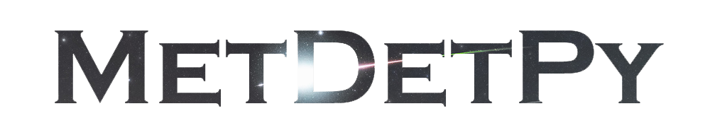

<div align="center">
  

[](https://github.com/LilacMeteorObservatory/MetDetPy/releases/latest) [](https://github.com/LilacMeteorObservatory/MetDetPy/releases/latest) [](./LICENSE) [](https://github.com/LilacMeteorObservatory/MetDetPy/releases)

<center>Language: English | <a href="./docs/readme-cn.md">简体中文</a></center>

</div>

## Introduction

MetDetPy is a Python-based meteor detector project that detects meteors from videos and images. Its video detection is inspired by [uzanka/MeteorDetector](https://github.com/uzanka/MeteorDetector). MetDetPy is powerful and reliable, with the following features:

* **Easy-to-use and Configurable:** MetDetPy is designed with easy-to-use default settings, so it can be used directly without detailed configuration under most circumstances. Settings are also supported to be changed to get better detection results.

* **Applicable for Various Devices and Exposure Time:** MetDetPy can detect meteors from video files captured by various types of devices. With adaptive algorithms and deep learning models, MetDetPy works fine for videos and images from full-frame cameras and monitor cameras.

* **Low CPU Usage:** MetDetPy works with relatively low CPU usage and supports multi-camera real-time detection on mainstream computers or barebones.

* **Optional Deep Learning Model:** MetDetPy has optional deep learning support. It can be selectively used in the main detection or recheck phase to improve detection results without significantly increasing performance overhead. The model can also be used for meteor detection in images.

* **Effective Filter:** Meteors will be rechecked according to visual appearance and motion properties to exclude false positive samples. Every prediction is given a confidence score ranging [0,1] which indicates the possibility of being considered a meteor.

* **Support Tools:** An evaluation tool and a video clip toolkit are also provided to support further video clipping, image stacking, or result evaluation.

## Release Version

You can get the latest release version of MetDetPy [here](https://github.com/LilacMeteorObservatory/MetDetPy/releases). The release version is already packed and can run on common platforms (including Windows, macOS, and Linux) respectively. Also, you can build it yourself with `nuitka` or `pyinstaller` (see [Package python codes to executables](#package-python-codes-to-executables)).

Besides, MetDetPy has worked as the backend of the Meteor Master since version 1.2.0. Meteor Master (AI) is a meteor detection software developed by [奔跑的龟斯](https://www.photohelper.cn), which has a well-established GUI, live streaming video support, convenient export function, automatic running, etc. You can get more information at [Meteor Master Official Site](https://www.photohelper.cn/MeteorMaster), or get its latest version from the Microsoft Store / App Store. Its earlier version can get from [Baidu NetDisk](https://pan.baidu.com/s/1B-O8h4DT89y_u1_YKXKGhA) (Access Code: jz01)

## Requirements

### Enviroments

* 64bit OS
* Python>=3.7 (3.9+ is recommended)

### Python Requirements

* numpy>=1.15.0
* opencv_python>=4.9.0
* tqdm>=4.0.0
* easydict>=1.0
* multiprocess>=0.70.0
* onnxruntime>=1.16.0

You can install these requirements using:

```sh
pip install -r requirements.txt
```

### GPU Support

The above packages enable MetDetPy to run properly, but the deep learning models are only supported on CPU devices for Windows and Linux users. If you wish to utilize your GPU, you can additionally install or replace the onnxruntime-related libraries as follows:

* **Recommended:** it is recommended to additionally install `onnxruntime-directml`. This library utilizes DirectX for model inference acceleration and is suitable for most GPUs (Nvidia, AMD, Intel, etc.).

* **Nvidia GPU Users (Advanced):** If you are using Nvidia GPUs and have CUDA installed, you can install the matched version of `onnxruntime-gpu` instead of `onnxruntime`. This enables CUDA acceleration, which brings higher performance.

#### ⚠️ Notice

* For macOS users, since CoreML model inference acceleration is integrated into the latest version of `onnxruntime`, there is nothing to do to enable  GPU support.

* In the current release version, it is `onnxruntime_directml` for Windows packages. Default CUDA support will be added when it is ready.

## Usage

### Run Video Meteor Detector

MetDetPy is the launcher of the video meteor detector, its usage is as follows:

```sh
python MetDetPy.py target [--cfg CFG] [--mask MASK] [--start-time START_TIME] [--end-time END_TIME] 
               [--exp-time EXP_TIME] [--mode {backend,frontend}] [--debug]
               [--resize RESIZE] [--adaptive-thre ADAPTIVE_THRE] [--bi-thre BI_THRE | --sensitivity SENSITIVITY]
               [--recheck RECHECK] [--save-rechecked-img SAVE_RECHECKED_IMG]
               [--provider {cpu,default,coreml,dml,cuda}][--live-mode {on,off}][--save SAVE]
```

#### Main Arguments

* target: meteor video filename. Support common video encoding like H264, HEVC, etc.

* --cfg: path to the configuration file. Use [./config/m3det_normal.json](./config/m3det_normal.json) under the config folder by default.

* --mask: mask image. To create a mask image, draw mask regions on a blank image using any color (except white). Support JPEG and PNG format.

* --start-time: the time at which the detection starts (an int in ms or a string format in `"HH:MM:SS"`). The default value is the start of the video (i.e., 0).

* --end-time: the time until which the detecting ends (an int in ms or a string format in `"HH:MM:SS"`). The default value is the end of the video.

* --mode: the running mode. Its argument should be selected from `{backend, frontend}`. In frontend mode, there will be a progress bar indicating related information. In backend mode, the progress information is flushed immediately to suit pipeline workflow.  The default is "frontend".

* --debug: indicates whether to print debug information.

* --visu: showing a debug window displaying videos and detected meteors.

* --live-mode: when running in live mode, the detection speed will closely match the actual video time. This option balance cpu cost. Should be selected from `{on, off}`.

* --provider: specifies the preferred provider to be used for models. The available providers may vary depending on the platform. If the specified provider is not available, the "default" option will be used.

* --save: save detection results (a list) to a json file.

#### Extra Arguments

The following arguments have default values in config files. If they are configured in command line arguments, the default value will be overrided. Their detailed explanation can be seen in [configuration documents](./docs/config-doc.md).

* --resize: the frame image size used during the detection. This can be set by single int (like `960`, for the long side), list (like `[960,540]`) or string (like `960x540` or `1920x1080`).

* --exp-time: the exposure time of each frame in the video. Set with a float number or select from {auto, real-time, slow}. For most cases, option "auto" works well.

* --adaptive-thre: indicates whether apply adaptive binary threshold in the detector. Select from {on, off}.

* --bi-thre: the binary threshold used in the detector. When the adaptive binary threshold is applied, this option is invalidated. Do not set --sensitivity with this at the same time.

* --sensitivity: the sensitivity of the detector. Select from {low, normal, high}. When adaptive binary threshold is applied, higher sensitivity will estimate a higher threshold. Do not set --bi-thre with this at the same time. 

* --recheck: indicates whether apply recheck mechanism. Select from {on, off}.

* --save-rechecked-img: the path where rechecked images are saved to.

#### Example

```sh
python MetDetPy.py "./test/20220413Red.mp4" --mask "./test/mask-east.jpg"
```

#### Customize Configuration

MetDetPy reads arguments from configuration files. For most circumstances, preset configuration files work well, but there are also times when better detection results can be achieved by adjusting detection arguments. This document explains the meanings of arguments so that they can adjusted according to the requirement. See [configuration documents](./docs/config-doc.md) for more information.

### Run Image Meteor Detector

To launch the image meteor detector, use `MetDetPhoto.py` as follows:

```sh
python MetDetPhoto.py target 
```

(WIP)

### Usage of Other Tools

Several tools are provided with MetDetPy to support related functions, including ClipToolkit (batch image stacking and video clipping tool), Evaluate (performance evaluation and regression testing tool), and make_package (packaging script). Access the [tool documentation](./docs/tool-usage.md) to learn more about how to use these tools.

## Performance and Efficiency

1. When applying default configuration on 3840x2160 10fps video, MetDetPy detect meteors with a 20-30% time cost of video length on average (tested with an Intel i5-7500). Videos with higher FPS may cost more time.

2. We test MetDetPy with videos captured from various devices (from modified monitoring cameras to digital cameras), and MetDetPy achieves over 80% precision and over 80% recall on average.

3. MetDetPy now is fast and efficient at detecting most meteor videos. However, when facing complicated weather or other affect factors, its precision and recall can be to be improved. If you find that MetDetPy performs not well enough on your video, it is welcome to contact us or submit issues (if possible and applicable, provide full or clipped video).

## License

This project is licensed under the Mozilla Public License 2.0 (MPL-2.0). This means you are free to use, modify, and distribute this software with the following conditions:

1. **Source Code Availability**: Any modifications you make to the source code must also be made available under the MPL-2.0 license. This ensures that the community can benefit from improvements and changes.
2. **File-Level Copyleft**: You can combine this software with other code under different licenses, but any modifications to the MPL-2.0 licensed files must remain under the same license.
3. **No Warranty**: The software is provided "as-is" without any warranty of any kind, either express or implied. Use it at your own risk.

For more detailed information, please refer to the [MPL-2.0 license text](https://www.mozilla.org/en-US/MPL/2.0/).

## Appendix

### Special Thanks

uzanka [[Github]](https://github.com/uzanka)

奔跑的龟斯 [[Personal Website]](https://photohelper.cn) [[Weibo]](https://weibo.com/u/1184392917) [[Bilibili]](https://space.bilibili.com/401484)

纸片儿 [[Github]](https://github.com/ArtisticZhao)

DustYe夜尘 [[Bilibili]](https://space.bilibili.com/343640654)

RoyalK [[Weibo]](https://weibo.com/u/2244860993) [[Bilibili]](https://space.bilibili.com/259900185)

MG_Raiden扬 [[Weibo]](https://weibo.com/811151123) [[Bilibili]](https://space.bilibili.com/11282636)

星北之羽 [[Bilibili]](https://space.bilibili.com/366525868/)

LittleQ

韩雅南

来自偶然

杨雳鹏

兔爷 [[Weibo]](https://weibo.com/u/2094322147)[[Bilibili]](https://space.bilibili.com/1044435613)

Jeff戴建峰 [[Weibo]](https://weibo.com/1957056403) [[Bilibili]](https://space.bilibili.com/474329765)

贾昊

### Update Log / Todo List

See [update log](docs/update-log.md).


### Statistics

[](https://star-history.com/#LilacMeteorObservatory/MetDetPy&Timeline)