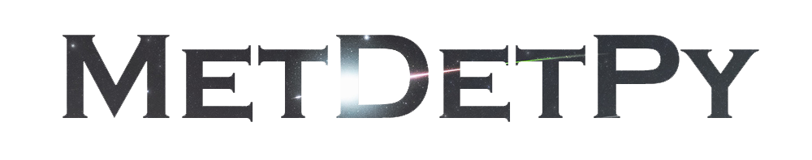

<div align="center">
  

[](https://github.com/LilacMeteorObservatory/MetDetPy/releases/latest) [](https://github.com/LilacMeteorObservatory/MetDetPy/releases/latest) [](./LICENSE) [](https://github.com/LilacMeteorObservatory/MetDetPy/releases)

<center>Language: English | <a href="./docs/readme-cn.md">简体中文</a></center>

</div>

## Introduction

MetDetPy is a Python-based meteor detector project that detects meteors from videos and images. Its video detection is inspired by [uzanka/MeteorDetector](https://github.com/uzanka/MeteorDetector). MetDetPy has the following features:

- **Easy-to-use and Configurable:** MetDetPy provides sensible default configurations so it works out-of-the-box in most situations, while also allowing configuration tweaks to improve detection results when needed.

- **Applicable for Various Devices and Exposure Times:** MetDetPy can detect meteors from videos and images captured by a wide range of devices. With adaptive algorithms and optional deep learning models, it works well for both meteor-monitoring cameras and conventional digital cameras.

- **Optional Deep Learning Integration:** Deep learning models can be optionally used in the main detection or recheck stage to improve results without significantly increasing runtime overhead. Models are also available for image-based meteor detection.

- **Effective Filters:** Detections are rechecked based on visual appearance and motion properties to reduce false positives. Each prediction is assigned a confidence score in [0,1], representing its likelihood to be a true meteor.

- **Support Tools:** MetDetPy ships several helper tools for evaluation and export, including an evaluation tool, a clip/stack toolkit, and packaging utilities.

## Release Version

You can get the latest release version of MetDetPy [here](https://github.com/LilacMeteorObservatory/MetDetPy/releases). The release artifacts are packaged for common platforms (Windows, macOS). You can also build standalone executables yourself using `make_package.py` (nuitka) or `make_package_pyinstaller.py` (pyinstaller) - see [Package python codes to executables](./docs/tool-usage.md#package-python-codes-to-executables) for details.

Besides, MetDetPy has worked as the backend of the Meteor Master since version 1.2.0. Meteor Master (AI) is a meteor detection software developed by [奔跑的龟斯](https://www.photohelper.cn), which has a well-established GUI, live streaming video support, convenient export function, automatic running, etc. You can get more information at [Meteor Master Official Site](https://www.photohelper.cn/MeteorMaster), or get its latest version from the Microsoft Store / App Store. Its earlier version can get from [Baidu NetDisk](https://pan.baidu.com/s/1B-O8h4DT89y_u1_YKXKGhA) (Access Code: jz01)

## Requirements

**Environment**

- 64bit OS
- Python>=3.7 (3.9+ is recommended)

**Python Requirements**

- numpy>=1.15.0
- opencv_python>=4.9.0
- tqdm>=4.0.0
- multiprocess>=0.70.0
- onnxruntime>=1.16.0
- av>=15.0.0
- dacite>=1.9.0
- pyexiv2>=2.12.0

You can install these requirements using:

```sh
pip install -r requirements.txt
```

### GPU Support

The above packages enable MetDetPy to run properly, but deep learning models in the default runtime are CPU-only on typical installations. If you wish to utilize your GPU, you can additionally install or replace the onnxruntime-related libraries as follows:

- **Windows / Linux (recommended):** install `onnxruntime-directml` to get DirectML-based acceleration on many GPUs (Nvidia, AMD, Intel). The package name on PyPI is `onnxruntime-directml`.

- **Nvidia GPU users (advanced):** if you have CUDA installed, install a CUDA-matched `onnxruntime-gpu` build instead of `onnxruntime` to enable CUDA acceleration.

#### ⚠️ Notice

- For macOS users, CoreML inference acceleration is already integrated into recent `onnxruntime` builds, so no extra step is normally required to enable GPU support on macOS.

- In the current packaged Windows release we use a DirectML-enabled runtime. Default CUDA wheels will be adopted when fully tested.

## Quick Start

MetDetPy's detection tools are designed with sensible default configurations and can run directly without additional parameters in most cases.

### Video Detection

```sh
# Detect video (results only output to command line)
python MetDetPy.py video.mp4

# Detect and save results
python MetDetPy.py video.mp4 --save-path results.json

# After detection, filter out all negative samples and small size results, export only all meteor segments as videos
python MetDetPy.py video.mp4 --save-path results.json
python ClipToolkit.py results.json --mode video --enable-filter-rules --save-path ./output

# Or export with bounding boxes
python ClipToolkit.py results.json --mode video --enable-filter-rules --with-bbox --save-path ./output
```

### Image Detection

```sh
# Detect image folder
python MetDetPhoto.py ./images

# Detect and save results
python MetDetPhoto.py ./images --save-path results.json

# After detection, filter out all negative samples and small size results, copy positive samples to another folder
python ClipToolkit.py results.json --enable-filter-rules  --save-path ./output

# Or export with bounding boxes
python ClipToolkit.py results.json --enable-filter-rules --with-bbox --save-path ./output
```

## Documentation

### Tool User Guides

* [Detection Tools User Guide](./docs/tool-usage/Detector-usage.md) - MetDetPy (video detector) and MetDetPhoto (image detector)
* [ClipToolkit User Guide](./docs/tool-usage/ClipToolkit-usage.md) - Video clipping and image stacking tool
* [Evaluate Tool Documentation](./docs/tool-usage.md#evaluate) - Performance evaluation and regression testing
* [make_package Tool Documentation](./docs/tool-usage.md#make-package) - Packaging script

### Configuration and Data Format

* [Configuration File Documentation](./docs/config-doc.md) - Understand the meaning of each configuration option
* [Data Format Documentation](./docs/data-format.md) - Understand input configuration and output file formats

## Performance and Efficiency

1. When applying default configuration on 3840x2160 10fps video, MetDetPy detect meteors with a 20-30% time cost of video length on average (tested with an Intel i5-7500). Videos with higher FPS may cost more time.

2. We test MetDetPy with videos captured from various devices (from modified monitoring cameras to digital cameras), and MetDetPy achieves over 80% precision and over 80% recall on average.

3. MetDetPy is fast and efficient at detecting most meteor videos. However, when facing complicated weather or other affecting factors, its precision and recall can be improved. If you find that MetDetPy does not perform well enough on your videos, you are welcome to contact us or submit an issue (please attach full or clipped videos when applicable).

## License

This project is licensed under the Mozilla Public License 2.0 (MPL-2.0). This means you are free to use, modify, and distribute this software with the following conditions:

1. **Source Code Availability**: Any modifications you make to the source code must also be made available under the MPL-2.0 license. This ensures that the community can benefit from improvements and changes.

2. **File-Level Copyleft**: You can combine this software with other code under different licenses, but any modifications to the MPL-2.0 licensed files must remain under the same license.

3. **No Warranty**: The software is provided "as-is" without any warranty of any kind, either express or implied. Use it at your own risk.

For more detailed information, please refer to the [MPL-2.0 license text](https://www.mozilla.org/en-US/MPL/2.0/).

## Appendix

### Special Thanks

uzanka [[Github]](https://github.com/uzanka)

奔跑的龟斯 [[Personal Website]](https://photohelper.cn) [[Weibo]](https://weibo.com/u/1184392917) [[Bilibili]](https://space.bilibili.com/401484)

纸片儿 [[Github]](https://github.com/ArtisticZhao)

DustYe夜尘 [[Bilibili]](https://space.bilibili.com/343640654)

RoyalK [[Weibo]](https://weibo.com/u/2244860993) [[Bilibili]](https://space.bilibili.com/259900185)

MG_Raiden扬 [[Weibo]](https://weibo.com/811151123) [[Bilibili]](https://space.bilibili.com/11282636)

星北之羽 [[Bilibili]](https://space.bilibili.com/366525868/)

LittleQ

韩雅南

来自偶然

杨雳鹏

兔爷 [[Weibo]](https://weibo.com/u/2094322147)[[Bilibili]](https://space.bilibili.com/1044435613)

Jeff戴建峰 [[Weibo]](https://weibo.com/1957056403) [[Bilibili]](https://space.bilibili.com/474329765)

贾昊

### Update Log / Todo List

See [update log](docs/update-log.md).

### Statistics

[](https://star-history.com/#LilacMeteorObservatory/MetDetPy&Timeline)
